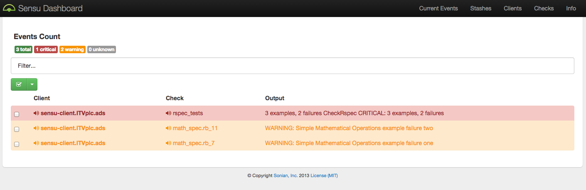

# Sensu-RSpec Integration

This is an example of how to integrate RSpec tests with Sensu.

It uses a slight modification of the `check-rspec` Sensu check that I contributed to [Sensu Community Plugins](https://github.com/sensu/sensu-community-plugins/blob/master/plugins/rspec/check-rspec.rb).

The Sensu version is `0.19.2-1` and dashboard (Uchiwa) is version `0.9.0-1`. You can change either of these in `hieradata/common.yaml`.

If you require a Sensu sandbox VM, check out my [vagrant-sensu](https://github.com/bsnape/vagrant-sensu) repository.

## Installation

Install Ruby, Vagrant and VirtualBox.

Then install the gem dependencies:

```bash
$ bundle install
```

Install the Puppet modules:

```
$ bundle exec librarian-puppet install
```

Bring up the VMs (this will take a while):

```bash
$ vagrant up
```

## Usage

Once the 2 VMs (server and client) are up and running, navigate to the [Sensu dashboard](http://33.33.33.90:3000/).

Here you can see the two separate warning alerts for failed tests and an overall critical alert
displaying the summary of how many tests have failed.


